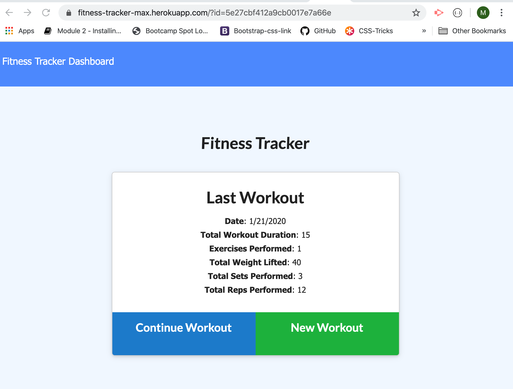
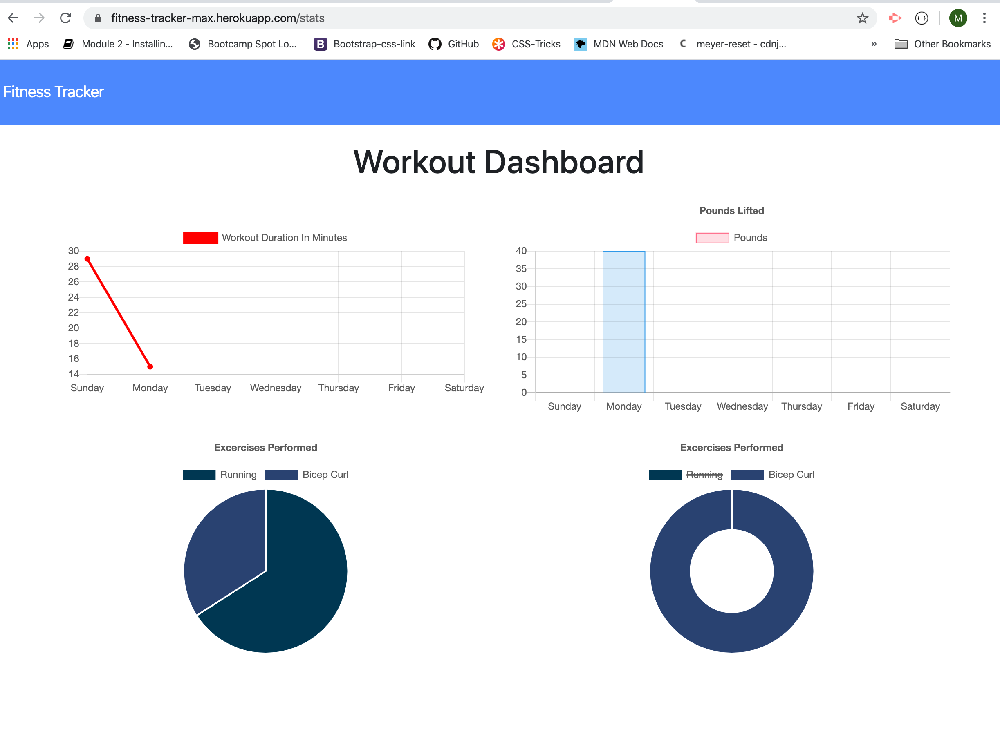

# H1 Workout Tracker

This homework assignment was designed for us to use MongoDB instead of mySQL.
The front end of the app was provided.  We needed to create the server.js file, and the apiroutes.js file

### H3 Description

We created a tracking app which allows a user to input or update a resistance or cardio workout into a Mongo Database.   This style database is quite different from mySQL or SQL, which have more ridgid rules about the types and formats the data can resinde in.  MongoDB stores the information in what is equivalent to Javascript objects

### H3 Live Site

[Fitness Tracker App](https://fitness-tracker-max.herokuapp.com/)

### H3 - Images

### H3 - Installation

All files should be left in their original locations - npm install will install all the required dependecies.  You can start the server with 'npm start'.  If you would like to seed the database - run 'npm run seed' after you have started your mongo database service.